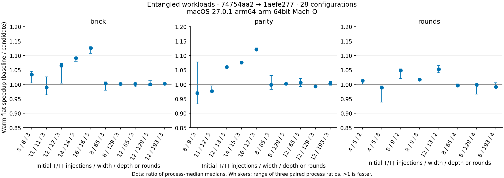

# Entangled workloads after the probability optimization

The [28-case paired table](apple-m4-entangled-2026-09-30.md) and
[raw JSON](apple-m4-entangled-2026-09-30.json) compare merged #768
(`74754aa27461ceca72f9145832e37bfd8040f066`) and #769
(`1aefe277faa199e59000ee186bed905fcb1668fa`) on Apple M4. The new
[entangled harness](../entangled/README.md) adapts the immutable scale timing
code and uses the same unified dependency lock on both sides. Three paired
processes alternate order, with three repetitions in each of six modes.
No production Rust, Cargo dependency, historical campaign, or atom-loss source
input changes are part of this benchmark extension.

## Validation coverage

Three families cover noncommuting entangling layers, long-range parity, and
mid-circuit syndrome measurement/reset/feedback with further T injections.
Wide workloads apply gates across 65/129/193 qubits rather than idle padding.
The requested initial T rank is 8/11/12/14/16 for terminal workloads; diagnostics
confirm each prepared rank. Wide 8-injection/four-round workloads reach observed
peak rank 12. Warmup and probe peak counters are separate; a cached probe can
visit lower-rank states without revisiting the prepared root.

All 28 full-width circuit checks compare structured/flat/prepared/individual
outputs and RNG continuation across both source revisions. Both diagnostic
builds repeat these checks against pristine binaries: 56 diagnostic checks pass.
The standalone build raises only the reused oracle allocation guard from 10 to
16 qubits; original/adapted source hashes are bound and matrix arithmetic is
unchanged. The repository oracle helper is not edited.
The independent dense-state oracle contributes 2682 conditional Born-probability
comparisons per revision over three seeded trajectories per configuration.
It checks 14 configurations at their exact physical width. The other 14 use
explicitly recorded reduced 8-data-qubit family witnesses retaining depth and
mid-circuit structure; this is not a full-width statistical validation. Each
witness exhibits one-qubit purity below 0.99, demonstrating entanglement.
Terminal samples additionally respect independent dense joint support; that
check does not establish full distribution frequencies. Per-seed manual/executor
equality is only required for unplanned workloads because terminal planning
can reorder commuting measurements and restore record order afterwards.

The final evidence verifier independently checks generated/historical driver,
fixture, lock, oracle, source, pristine/diagnostic binary and overlay hashes,
expected witness disclosures, alternating process order, counters, node budgets,
records and raw timing medians. Twelve contract tests pass under normal and
optimized Python, including negative controls that recompute semantic hashes
before attempting to relabel reduced witnesses as full-width checks. Two Rust
harness tests validate invalid parameters and independent physics in all three
families. `make check` and scoped formatting/whitespace checks pass. CI runs the
evidence verifier and contract tests. Existing atom-loss source inputs remain
identical, so their sealed publication bundle remains valid without regeneration.

## Measured effect of #769

Warm-flat milliseconds, medians of process medians; speedup is their ratio:

| Workload | Shots | #768 ms | #769 ms | Speedup |
| --- | ---: | ---: | ---: | ---: |
| Brick rank 12 / width 12 | 16 | 0.3463 | 0.3253 | 1.06× |
| Brick rank 14 / width 14 | 16 | 0.9498 | 0.8706 | 1.09× |
| Brick rank 16 / width 16 | 8 | 1.5532 | 1.3802 | 1.13× |
| Parity rank 16 / width 17 | 8 | 1.5967 | 1.4246 | 1.12× |
| Parity rank 12 / width 129 | 16 | 26.2747 | 26.4516 | 0.99× |
| Four rounds / width 129 | 64 | 74.8431 | 74.9276 | 1.00× |

Rank-14/16 compact terminal workloads improve about 8–13%. Both rank-12 terminal
families improve about 6%. These effects are smaller than the previous
independent-axis 22–27% gains. Width 65/129/193 workloads are within about 1% of
baseline; small feedback effects vary. Cached rank-8 parity is 3–4% slower in
several modes and rank-11 parity warm-flat about 2% slower. These small changes
are disclosed without treating them as established statistical effects.
No configuration in the six modes meets the screen (median paired slowdown
≥15% and every pair ≥10%). This screen is not a significance test. The plot
exposes the three-pair spread, including noisy small/cached cases, rather than
treating small changes as guaranteed gains. RSS includes validation, live
samplers and outputs.

## Profiles and next optimization

[Profile metadata](apple-m4-entangled-profiles-2026-09-30/metadata.json) binds three
exact retained circuits to a separate release/debug/frame-pointer binary. These
percentages are inclusive main-thread samples, not pristine timing-build function
speedups. Repeated ancestor/descendant frames of the same function are counted
once. Rows can overlap and must not be added together.

| Circuit | Function | Inclusive samples | Main samples | Fraction |
| --- | --- | ---: | ---: | ---: |
| Brick rank 16 / width 16 | project_active_measurement | 3796 | 6019 | 63.1% |
| Brick rank 16 / width 16 | pauli_probability_zero | 1621 | 6019 | 26.9% |
| Parity rank 12 / width 129 | absorb_independent_measurement | 4813 | 6111 | 78.8% |
| Parity rank 12 / width 129 | StabilizerState::row_mult | 3566 | 6111 | 58.4% |
| Parity rank 12 / width 129 | pauli_probability_zero | 36 | 6111 | 0.6% |
| Four rounds / width 129 | apply_clifford | 2696 | 6080 | 44.3% |
| Four rounds / width 129 | absorb_independent_measurement | 2073 | 6080 | 34.1% |
| Four rounds / width 129 | StabilizerState::row_mult | 1310 | 6080 | 21.5% |
| Four rounds / width 129 | pauli_probability_zero | 33 | 6080 | 0.5% |

Next, optimize independent-measurement absorption and tableau row operations
for wide entangled workloads. Preserve full-width output/RNG checks and reduced
independent physics controls. Then revisit projection allocation/traversal for
compact high-rank workloads. These representative results give concrete targets;
an indiscriminately larger timing matrix is not the next priority. After a
measured improvement, run both the original 43-case matrix and these 28 cases
before moving to application-scale workloads. x86 performance remains unmeasured;
this report's timing and profiles are M4-only.

Reproduce with the commands in the harness README using fresh scratch/output
paths. Retained source SHAs are reachable through the repository's master history.
Prototype and smoke timings are not pooled into this campaign.
