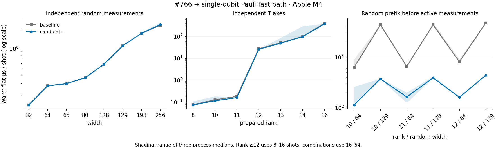

# Single-qubit Pauli conversion performance

The specialized tableau-column path removes the dominant dense-coordinate scan
identified by the preceding scale campaign. Against merged #766 (`f4b59661`), the
implementation source `f1084edb` improves high-rank/wide-random-prefix sampling by
about 4–12× while preserving seeded outputs and RNG continuation. It does not
change cache limits or the generic T-rotation path.

## Evidence

- [43-case paired table](apple-m4-pauli-2026-09-30.md) and
  [raw timings/diagnostics](apple-m4-pauli-2026-09-30.json): three paired process
  runs, three repetitions per mode, same retained dependency lock and compiler.
- 35 circuit checks compare structured/flat output, prepared/individual shots,
  and RNG continuation within and across revisions. All pass.
- 70 diagnostic-build circuit checks compare outputs/RNG against pristine builds.
  All pass. Overlay counters never enter performance measurements.
- 47 focused integration tests, including an independent four-qubit state-vector
  oracle embedded across physical widths 4/64/65/128/129/193, pass. The randomized
  private differential test checks phase and coordinates through width 193;
  all 13 near-Clifford unit tests pass. `make check` passes.
- The new campaign entry records its own hash. `verify.py --git-sources --binaries`
  checks selected git-source hashes, runner/entry/harness/lock hashes, repetition
  completeness, binary hashes, diagnostics and node budgets. It passes.

The clock-resolution edge case for zero shots now reports an undefined speedup
as `n/a`; the selected-revision report also identifies the actual source SHAs.
The historical #764/#766 runner remains unchanged to preserve its evidence hash.
An interrupted pre-fix run is retained only under ignored scratch and is not pooled
with the completed campaign.

## Results

Warm flat sampling, median of paired process medians, in milliseconds:

| Workload | Shots | #766 | Fast path | Speedup |
| --- | ---: | ---: | ---: | ---: |
| Rank 10 / random prefix 64 | 64 | 40.1482 | 7.3036 | 5.50× |
| Rank 10 / random prefix 129 | 64 | 278.4794 | 23.8076 | 11.70× |
| Rank 11 / random prefix 64 | 64 | 41.9963 | 10.5263 | 3.99× |
| Rank 11 / random prefix 129 | 64 | 279.4264 | 24.9818 | 11.19× |
| Rank 12 / random prefix 64 | 16 | 12.9491 | 2.5798 | 5.02× |
| Rank 12 / random prefix 129 | 16 | 75.7758 | 7.0195 | 10.79× |
| Rank 12 | 16 | 0.4429 | 0.4172 | 1.06× |
| Syndrome rounds 32 | 1000 | 21.7123 | 21.5951 | 1.01× |

No positive-shot case meets the regression screen of median paired slowdown ≥15%
and slowdown ≥10% in every pair. This is a screening rule, not a significance test.
Small calls near timer resolution cannot establish a reliable speedup.

RSS is essentially unchanged for the important combination case: rank 11 / prefix
129 is 119.7 versus 119.8 MiB at the harness process peak. This includes validation,
multiple live samplers and output allocations; it is not a single-cache allocation.
The cache policy and fallback counts remain comparable.



## Remaining hotspots

[Post-change profiles](apple-m4-pauli-profiles-2026-09-30/metadata.json) use a separate
release build with debug line information and frame pointers, after timing finishes.

For [rank 11 / prefix 129](apple-m4-pauli-profiles-2026-09-30/combo_11_129.sample.txt),
the former `physical_pauli` hotspot is replaced by axis canonicalization (2350/6645
main-thread samples at top of stack, 35.4%), the specialized single-qubit path
(1453, 21.9%), and several smaller frame/reconstruction/allocation costs.

[Rank 12](apple-m4-pauli-profiles-2026-09-30/rank_12.sample.txt) still spends most
samples in collapse/projection (2837/6689, 42.4%), probability calculation (1963,
29.3%) and vector collection (910, 13.6%). These are the next targeted optimization,
rather than increasing cache coefficients to move the threshold to rank 13.

The [32-round syndrome profile](apple-m4-pauli-profiles-2026-09-30/qec_32.sample.txt)
remains distributed over CX, T rotation, measurement and allocation. This change
only addresses single-qubit measurement Pauli conversion.

## Reproduction

Use a fresh scratch path for each new source pair:

```sh
python3 benchmarks/near_clifford/scale/run_pair.py \
  --baseline f4b5966129aee3d617181414f805eb1250e1cc5d \
  --candidate f1084edbd404d724e9ef6ea35d75ccf61dff2e19 \
  --scratch drafts/near-clifford-pauli-reproduction \
  --output drafts/near-clifford-pauli-reproduction/results.json
python3 benchmarks/near_clifford/scale/verify.py \
  drafts/near-clifford-pauli-reproduction/results.json \
  --git-sources --binaries drafts/near-clifford-pauli-reproduction
```

This is Apple M4 evidence. x86 timing remains unavailable because the OMEN node's
replacement environment does not currently expose a Rust toolchain.
