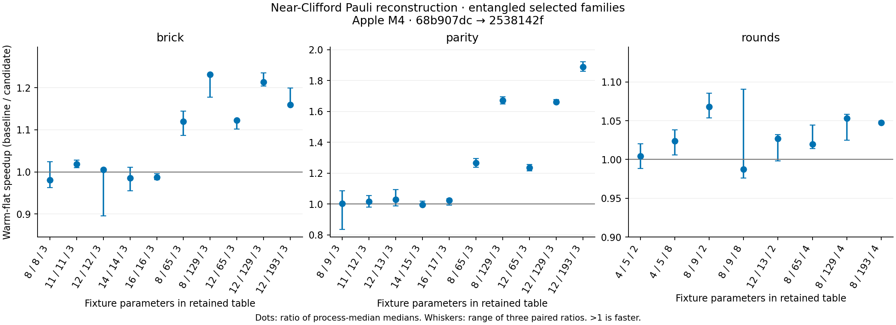
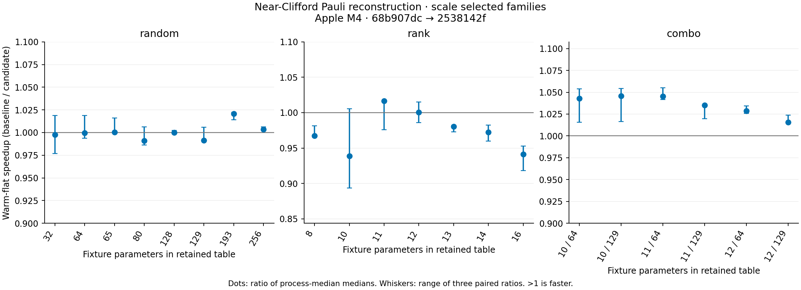
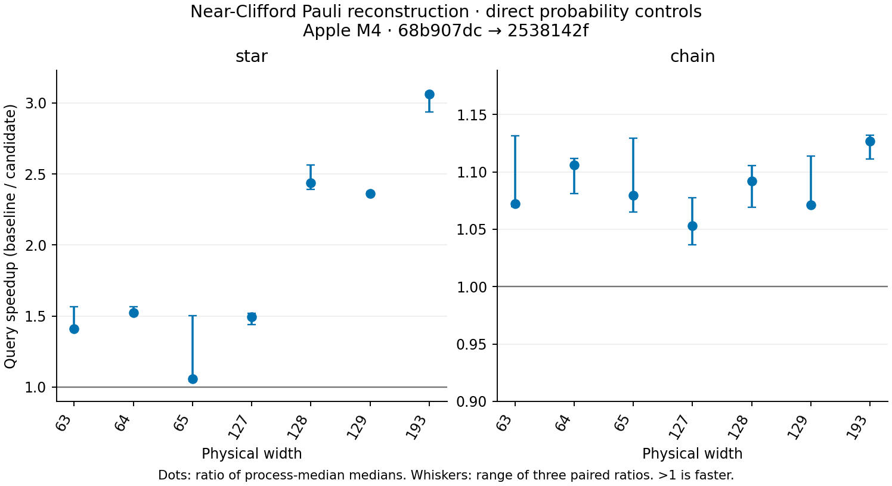

# Pauli reconstruction after the near-Clifford row-operation improvement

The [43-case scale table](apple-m4-pauli-scale-2026-10-03.md),
[28-case entangled table](apple-m4-pauli-entangled-2026-10-03.md) and
[14 direct controls](apple-m4-pauli-support-2026-10-03.md) compare the row-operation
implementation `68b907dc9f6c3e938a98a07624592b0865ed6852` with fused Pauli reconstruction
`2538142f96c9009795aa1f1348ba45f3a16b4fc0`. These are incremental gains over #771,
not cumulative gains over #770. Each campaign has three alternating process pairs
and three repetitions; prototypes and previous campaigns are not pooled.
Reproduction and verification commands are in the [campaign README](../pauli_products/README.md).

## Implementation and correctness

`Pauli::multiply_tableau_row` previously traversed the selected row four times:
counting canonical Y phases, accumulating the multiplication sign, then XORing X
and Z coordinates. It now performs the same integer operations in a single
contiguous traversal. Its Pauli convention is `i^phase X^x Z^z`, distinct from
canonical per-qubit tableau Paulis. The right-row phase contribution is
`right_x * right_z + 2 * left_z * right_x`, modulo four, before XORing the left
coordinates. Wrapping integer accumulation preserves the modulo-four result.

This change preserves row multiplication order, frame state, allocations, RNG
draws, floating-point reductions, cache budgets and public APIs. The legacy
`tableau.rs` implementation is byte-identical to the baseline. Signed local
X/Y/Z rows and all four left phases are compared against the previous separate-pass
reference. Chained row products check complete X/Z/phase results across word
boundaries through width 4096, including dense Y rows and composed CZ frames.

The full-width magic-GHZ integration witness now uses both star and chain CX
frames at widths 2/63/64/65/127/128/129/193. Every qubit participates. Independent
analytic conditional Born probabilities cover mixed X/Y measurements, reset and
final X/Y/Z queries, with seeded outcomes. The benchmark's direct controls retain
all four pristine/diagnostic semantic payload sets and RNG continuation, with two
seeded full-width witnesses per topology and width. The verifier recomputes the
physical phase from outcomes rather than trusting retained expected values.

The unchanged end-to-end drivers retain six timing modes and cache-boundary,
compact high-rank, reset and feedback controls. Their independent entangled dense
coverage remains 14 exact-width and 14 explicitly reduced family witnesses, with
2,682 conditional Born comparisons per revision. Reduced witnesses do not establish
the full wide family distribution. The GHZ controls complement that limit for
two specified frame topologies; they do not establish frequency accuracy for all
synthetic workloads.

## End-to-end measurements

Warm-flat milliseconds are medians of three process medians; speedup is their ratio.

| Workload | Shots | Row operations | Fused Pauli | Speedup |
| --- | ---: | ---: | ---: | ---: |
| Brick rank 8 / width 129 | 64 | 19.376 | 15.733 | 1.23× |
| Parity rank 12 / width 129 | 16 | 11.926 | 7.180 | 1.66× |
| Parity rank 12 / width 193 | 16 | 25.988 | 13.762 | 1.89× |
| Four rounds / width 129 | 64 | 61.544 | 58.426 | 1.05× |
| Four rounds / width 193 | 64 | 165.305 | 157.813 | 1.05× |
| Brick rank 16 / width 16 | 8 | 1.385 | 1.403 | 0.99× |
| Independent rank 11 / prefix 129 | 64 | 14.277 | 13.789 | 1.04× |
| Independent rank 12 / prefix 129 | 16 | 3.789 | 3.730 | 1.02× |
| Independent rank 16 | 8 | 1.405 | 1.492 | 0.94× |
| Syndrome rounds 32 | 1000 | 21.067 | 21.256 | 0.99× |
| Feedback rounds 32 | 1000 | 13.721 | 13.735 | 1.00× |
| Terminal 20q | 1000000 | 98.390 | 98.713 | 1.00× |

The wide uncached terminal parity workloads improve materially. Mid-circuit
rounds gain about 5%; their dominant physical Clifford work is unchanged. Compact
high-rank and already symbolic terminal sampling gain little. Several independent
rank cases have approximately 3–6% median paired warm-flat slowdowns; rank 16's
three paired slowdowns are about 8.9%, 6.3% and 4.9%. Other small/cached cases
have noisy spreads. These results are retained, not removed from the matrix.

Neither campaign triggers the predefined six-mode screen: median paired slowdown
at least 15% and every pair at least 10%. The scale screen excludes three
zero-baseline-duration modes of the zero-shot terminal fixture: unprepared,
first-prepared-structured and warm-prepared-flat. These remain visible in the raw
results; the warm-flat table reports an unavailable ratio instead of dividing by
zero. The screen is not a significance test or proof that no regression exists.

Plot ranges show the three paired process ratios, not confidence intervals. RSS
is whole-process high-water memory including validation, live samplers and outputs;
it cannot be interpreted as isolated cache or kernel memory.

## Direct reconstruction controls

The same rank-one magic-GHZ state is prepared with star or chain CX frames. A Y
probability query at qubit zero selects width+1 rows in the star frame and three
rows in the chain frame. The untimed diagnostic overlay counts actual row products
and processed entries, and verification checks these predictions. Rank, physical
state, query count and warmup policy are fixed while frame support changes.

| Frame / width | Selected rows | Entries per query | Baseline ms | Candidate ms | Speedup |
| --- | ---: | ---: | ---: | ---: | ---: |
| Star / 129 | 130 | 16770 | 4.097 | 1.734 | 2.36× |
| Chain / 129 | 3 | 387 | 0.713 | 0.665 | 1.07× |
| Star / 193 | 194 | 37442 | 8.904 | 2.910 | 3.06× |
| Chain / 193 | 3 | 579 | 1.135 | 1.007 | 1.13× |

Each repetition makes 1024 direct probability queries after 32 warmup queries.
Preparation, physics checks and counters are outside timing. This measures the
complete direct query, including coordinate conversion and allocation, rather
than the isolated row function. The direct ActiveState API has no terminal cache.
The star/chain contrast supports the proposed reconstruction bottleneck while
retaining a sparse-support control.

## Remaining profiles and next step

[Profile metadata](apple-m4-pauli-profiles-2026-10-03/metadata.json) binds the exact
circuits, candidate sources, lock, driver and a separate debug/frame-pointer
release binary. Profiles use 64-shot batches, including for compact rank 16;
these batches are not campaign timing observations. The parser reads only the
main-thread call graph and counts each matching function once per stack path,
excluding the native sample report's repeated aggregate summaries.

| Circuit | Function | Samples / main samples | Fraction |
| --- | --- | ---: | ---: |
| Brick rank 16 / width 16 | project_active_measurement | 3823 / 5999 | 63.7% |
| Brick rank 16 / width 16 | pauli_probability_zero | 1589 / 5999 | 26.5% |
| Parity rank 12 / width 129 | single_qubit_pauli | 3074 / 5990 | 51.3% |
| Parity rank 12 / width 129 | reconstruct_physical_pauli | 1919 / 5990 | 32.0% |
| Parity rank 12 / width 129 | Pauli::multiply_tableau_row | 1549 / 5990 | 25.9% |
| Parity rank 12 / width 129 | absorb_independent_measurement | 3203 / 5990 | 53.5% |
| Parity rank 12 / width 129 | row_mult_near_clifford | 881 / 5990 | 14.7% |
| Four rounds / width 129 | apply_clifford | 3425 / 6020 | 56.9% |
| Four rounds / width 129 | single_qubit_pauli | 904 / 6020 | 15.0% |
| Four rounds / width 129 | absorb_independent_measurement | 1062 / 6020 | 17.6% |

Inclusive fractions overlap and must not be added. They do not establish pristine
binary function speedups, and fractions from successive profiles cannot be turned
into absolute time savings.

Continue with one focused compact high-rank projection improvement: its measured
projection path still accounts for about 64% of main-thread samples, and the
retained independent rank controls expose small regressions requiring attention.
Use the current paired matrix and exact phase/conditional-probability tests to
judge that change. Further wide reconstruction work remains plausible, but would
need stronger evidence before introducing persistent coordinate caches or frame
invalidation complexity. Application-scale syndrome/feedback workloads and an
x86 paired run are useful additional evidence, rather than more generic synthetic
cases. The OMEN preflight found no Rust/Cargo toolchain, so no installation or x86
measurement occurred. All performance conclusions here are Apple M4-only.

## Evidence checks

Verifiers bind pristine and diagnostic source inputs, legacy tableau bytes,
immutable historical drivers/fixtures, the unified lock, overlays and executable
hashes, as well as raw medians, alternating pair order, complete semantic payloads
and work counters. The original commit is checked directly whenever it exists.
Only if it is unavailable after a squash merge may an exact selected-file hash
at the same path in HEAD ancestry substitute. Other branches, working-tree bytes,
present-but-mismatched commits and missing paths are rejected. This establishes
selected-file identity, not the lost original commit's full build tree.

Ten source-contract controls, six direct-campaign negative controls and four
report/parser controls run under normal Python and `python -O`. They include
aggregate-summary double counting, other-thread exclusion, zero-shot reporting,
screen thresholds, incomplete semantic payloads and source/overlay/counter mutations.
Executable hashes were separately checked against the retained campaign binaries.
Profiles and all raw timing inputs remain retained; derived tables and figures
can be regenerated from the versioned JSON and native samples.
