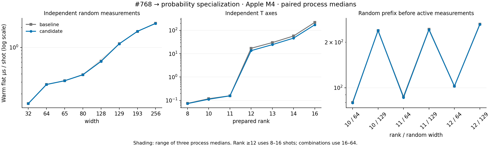

# Probability arithmetic optimization after #768

The [43-case table](apple-m4-probability-2026-09-30.md) and
[raw results](apple-m4-probability-2026-09-30.json) compare merged #768
(`74754aa27461ceca72f9145832e37bfd8040f066`) with
`f61d1e8d5fe61b3cc880d050e7396f2843669553` on Apple M4. Each configuration
uses three paired process runs, with three repetitions in each of six sampling
modes. Baseline and candidate use the same retained `Cargo.unified.lock` and
unchanged timing driver. Prototype/precheck samples are not pooled into this run.

## Change and correctness

Hermitian Pauli expectation uses real dot/cross products selected outside the
coefficient loop. Diagonal single-axis signs scan contiguous blocks; the lowest
axis processes adjacent pairs with two separate accumulator additions. XOR
orbits retain the previous highest-bit pivot, enumeration and per-orbit factor
of two. No floating-point reassociation, SIMD reduction, cache/API changes or
RNG changes are introduced.

A differential unit test compares probability bits against the previous generic
complex formula at ranks 1, 2, 4, 8, 12 and 16, covering fixed/random sign masks,
XOR masks, both origins, Hermitian phases, signed zero and tiny coefficients.
A new independent-factor dense oracle exercises a rank-16 state across physical
widths 16, 65, 129 and 193, with signed X/Y/Z probabilities and sequential
measurement/reset. Existing entangled tests cover non-factorized correlations.
All 49 focused integrations and 17 near-Clifford unit tests pass; `make check`
passes. All 35 cross-revision circuit/output/RNG checks and 70 untimed diagnostic
checks pass. `verify.py --git-sources --binaries` confirms the retained campaign.

## Results

Warm-flat milliseconds, median of three process medians. Speedup is the ratio
of those baseline/candidate medians; process pairing is used for the regression
screen below:

| Workload | Shots | #768 | Candidate | Median-time speedup |
| --- | ---: | ---: | ---: | ---: |
| Rank 11 | 1000 | 0.1579 | 0.1569 | 1.01× |
| Rank 12 | 16 | 0.2727 | 0.2155 | 1.27× |
| Rank 13 | 16 | 0.4766 | 0.3891 | 1.22× |
| Rank 14 | 16 | 0.9129 | 0.7396 | 1.23× |
| Rank 16 | 8 | 1.7459 | 1.3781 | 1.27× |
| Rank 11 / prefix 129 | 64 | 15.5808 | 15.4951 | 1.01× |
| QEC 1 | 1000 | 1.8924 | 1.9630 | 0.96× |
| Terminal 20q | 64 | 0.1165 | 0.1218 | 0.96× |

Rank 12–16 warm-flat improves 1.22–1.27×; cold sampling improves 1.13–1.24×.
Other broad groups are approximately flat. QEC 1 and the 64-shot terminal case
are approximately 4% slower in warm-flat; these small regressions are retained
and disclosed. No positive-shot case in any of the six modes meets the screen:
median paired slowdown ≥15% and every pair ≥10%. This is a regression screen,
not a significance test. Sub-microsecond one/two-shot timings remain sensitive
to clock quantization. RSS includes validation, multiple live samplers and
outputs; it does not measure one cache's memory.



## Remaining hotspots

[Profile metadata](apple-m4-probability-profiles-2026-09-30/metadata.json) retains
the separate release/debug/frame-pointer binary and sample/circuit hashes.
At rank 12, probability has 2194/6397 main samples (34.3%), versus 47.4% in the
previous projection campaign. Projection accounts for 2710/6397 (42.4%), counting
each inclusive stack once. Percentages describe the profiling build and are not
pristine timing-build measurements or absolute function speedups. The prefix
129 and QEC 32 profiles still expose Pauli/tableau work rather than a broad
probability bottleneck. Further optimization should be guided by projection
allocation/traversal and wider tableau costs, with representative entangled
workloads before changing reduction order or state representation.

## Reproduction

```sh
python3 benchmarks/near_clifford/scale/run_unified.py \
  --baseline 74754aa27461ceca72f9145832e37bfd8040f066 \
  --candidate f61d1e8d5fe61b3cc880d050e7396f2843669553 \
  --scratch drafts/near-clifford-probability-reproduction \
  --output drafts/near-clifford-probability-reproduction/results.json
python3 benchmarks/near_clifford/scale/verify.py \
  drafts/near-clifford-probability-reproduction/results.json \
  --git-sources --binaries drafts/near-clifford-probability-reproduction
```

This is M4-only timing evidence. x86 timing remains unavailable because the
OMEN replacement environment does not expose a Rust toolchain.
