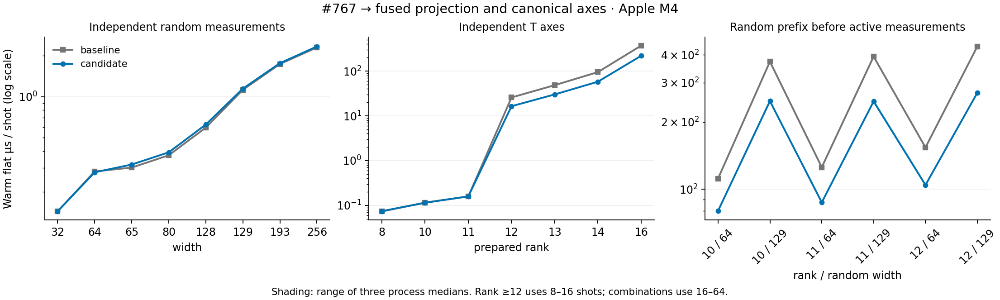

# Fused projection and canonical-axis reuse

The [final campaign on the merged unified CLI baseline](apple-m4-projection-synced-analysis-2026-09-30.md) supersedes the measurements below for the final PR. This earlier matched campaign remains independently reproducible.

Against merged #767 (`7fd765e3`), implementation `85dbff62` improves warm flat
sampling at ranks 12–16 by 1.57–1.68× and rank/random-prefix combinations by
1.39–1.61×. Canonical axes use a lightweight boolean validity flag; projection
writes and normalizes the surviving half directly. Cache limits remain unchanged.

## Evidence

- [43-case paired table](apple-m4-projection-2026-09-30.md) and
  [raw timings/diagnostics](apple-m4-projection-2026-09-30.json): three paired
  process invocations, three repetitions for each of six sampling modes.
- All 35 cross-revision circuit checks pass, including structured/flat outputs,
  prepared/individual shots and RNG continuation. All 70 diagnostic overlay
  comparisons pass. Counters are excluded from timing builds.
- `verify.py --git-sources --binaries` passes: source, harness, lock, runner and
  binary hashes, repetitions, diagnostic results and node budgets agree.
- 48 focused integration tests and 16 near-Clifford unit tests pass. New tests
  compare bulk canonicalization and fused projection with the previous operations
  through width 193, including signed coordinates, Y phase, origin rebasing and
  tiny-outcome rollback. An independent four-logical-qubit dense oracle with eight
  spectator magic states checks rank-12 circuits at widths 12/65/129, measurement,
  reset, feedback and all 255 final nonidentity Pauli expectations.
- Final `make check` and scoped `rustfmt --check` pass.

## Results

Warm flat milliseconds, median of the three process medians:

| Workload | Shots | #767 | Candidate | Speedup |
| --- | ---: | ---: | ---: | ---: |
| Rank 11 | 1000 | 0.1585 | 0.1593 | 1.00× |
| Rank 12 | 16 | 0.4116 | 0.2627 | 1.57× |
| Rank 13 | 16 | 0.7748 | 0.4815 | 1.61× |
| Rank 14 | 16 | 1.5190 | 0.9258 | 1.64× |
| Rank 16 | 8 | 2.9541 | 1.7541 | 1.68× |
| Rank 10 / prefix 64 | 64 | 7.1523 | 5.1290 | 1.39× |
| Rank 10 / prefix 129 | 64 | 23.8808 | 15.8981 | 1.50× |
| Rank 11 / prefix 64 | 64 | 8.0358 | 5.5933 | 1.44× |
| Rank 11 / prefix 129 | 64 | 25.1605 | 15.8444 | 1.59× |
| Rank 12 / prefix 64 | 16 | 2.4643 | 1.6729 | 1.47× |
| Rank 12 / prefix 129 | 16 | 6.9780 | 4.3288 | 1.61× |
| Feedback 1 | 1000 | 0.8174 | 0.8090 | 1.01× |

The 65/80/128 independent random-bit fixtures have a reproducible approximately
5% warm-flat slowdown (0.95×), although cold sampling is approximately unchanged.
Their pure-Clifford suffix execution is not modified by this diff; the measurement
alone does not establish the cause. These are accepted small regressions in this
campaign and prevent a claim that every workload improves. Across all six modes,
no positive-shot configuration meets the screen of median paired slowdown ≥15%
and slowdown ≥10% in every pair. This screen is not a significance test.

The earlier [vector-cache candidate](apple-m4-projection-vector-cache-2026-09-30.json)
and [table](apple-m4-projection-vector-cache-2026-09-30.md) are retained as a separate
matched campaign at `2fb8756d`. It shows similar large-rank gains but an 8% rank-11
warm slowdown. The final boolean flag avoids cloning cached pivot vectors and
restores that case to approximately equal performance. These campaigns are not
pooled; only `85dbff62` represents the final implementation.

Peak harness RSS for rank 11 / prefix 129 is approximately 119.8 MiB on both sides.
It includes validation, several live samplers and outputs, not a single cache.
Cache/fallback counters remain comparable; random_65 permits one fewer node under
its byte budget because the private state layout changes. No budget is increased.



## Remaining hotspots

[Final profiles](apple-m4-projection-profiles-2026-09-30/metadata.json) use a separate
release build with debug information and frame pointers after timing completes.
Sample counts describe this profiling build, rather than timing-build percentages.

For [rank 11 / prefix 129](apple-m4-projection-profiles-2026-09-30/combo_11_129.sample.txt),
axis canonicalization is no longer a top-of-stack hotspot (the previous #767 profile
had 2350/6645 samples). Single-qubit Pauli conversion now leads at 2042/5892 samples
(34.7%), followed by tableau row multiplication (573) and reconstruction (523).
Allocation and independent measurement absorption also remain visible.

For [rank 12](apple-m4-projection-profiles-2026-09-30/rank_12.sample.txt), probability
calculation is 2770/5962 samples (46.5%) and fused projection 1771 (29.7%). The former
full projection followed by vector collection has disappeared. A next optimization
should target probability/projection coefficient passes with the same phase and
numerical tests, then repeat the matched rank sweep before considering cache limits.

The [32-round syndrome profile](apple-m4-projection-profiles-2026-09-30/qec_32.sample.txt)
remains spread over CX, rotation, tableau measurement and allocation. Its timing is
approximately unchanged (1.01×).

## Reproduction

Use a new scratch directory for each source pair:

```sh
python3 benchmarks/near_clifford/scale/run_pair.py \
  --baseline 7fd765e3c12a9602b8da5e9e43e901cbf3d2bd9c \
  --candidate 85dbff62f03b0dc5419bf8726571c7f5b5e660df \
  --scratch drafts/near-clifford-projection-reproduction \
  --output drafts/near-clifford-projection-reproduction/results.json
python3 benchmarks/near_clifford/scale/verify.py \
  drafts/near-clifford-projection-reproduction/results.json \
  --git-sources --binaries drafts/near-clifford-projection-reproduction
```

Measurements are Apple M4 only. x86 timing remains unavailable because the OMEN
replacement environment does not currently expose a Rust toolchain.
