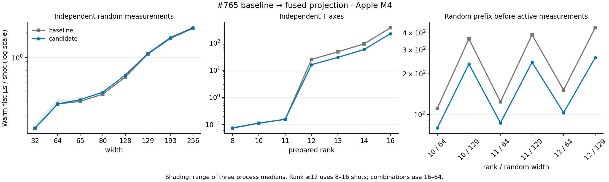

# Projection optimization on the unified CLI baseline

This final campaign compares merged #765 (`8affd850`) with the same reviewed
projection implementation integrated at `5d6f7712`. The implementation and oracle
Git blobs are identical to `85dbff62`; source/build inputs and default dependencies
changed with the CLI merge, so evidence is regenerated independently.

The [43-case table](apple-m4-projection-synced-2026-09-30.md) and
[raw results](apple-m4-projection-synced-2026-09-30.json) contain three paired process
runs with three repetitions in each of six modes. All 35 cross-revision circuit
checks and 70 diagnostic checks pass, including outputs and RNG continuation.
`verify.py --git-sources --binaries` passes for the new and historical campaigns.

`run_unified.py` uses separately retained `Cargo.unified.lock`, obtained by fresh
dependency resolution. It includes new default dependencies and updates some
shared dependency versions; both baseline and candidate use the identical lock.
Historical driver, runner, entry and lock remain unchanged. Old and new samples
are not pooled. Unknown entry and missing-hash negative controls are rejected by
both the verifier and profiler.

## Results

Warm-flat milliseconds, median of three process medians:

| Workload | Shots | #765 | Candidate | Speedup |
| --- | ---: | ---: | ---: | ---: |
| Rank 11 | 1000 | 0.1552 | 0.1547 | 1.00× |
| Rank 12 | 16 | 0.3980 | 0.2545 | 1.56× |
| Rank 13 | 16 | 0.7557 | 0.4716 | 1.60× |
| Rank 14 | 16 | 1.4867 | 0.9250 | 1.61× |
| Rank 16 | 8 | 2.9004 | 1.7586 | 1.65× |
| Rank 11 / prefix 129 | 64 | 24.7448 | 15.5277 | 1.59× |
| Rank 12 / prefix 129 | 16 | 6.9765 | 4.1975 | 1.66× |
| Feedback 1 | 1000 | 0.7938 | 0.7791 | 1.02× |

The six rank/prefix combinations improve by 1.40–1.66×. Pure-Clifford random
65/80/128 remain approximately 5% slower in warm-flat mode (0.95×), with cold
sampling approximately unchanged. This accepted small regression is reproduced
on both baselines. No positive-shot case in the six modes meets the screening
rule: paired slowdown median ≥15% and every pair ≥10%. It is not a significance
test. Sub-microsecond one/two-shot cases remain sensitive to clock quantization.



## Verification and profile

After synchronization, `make check`, the same 48 focused integration tests and
16 near-Clifford unit tests all pass. Source binding and publication verification
are regenerated with the new unified `rstim` CLI. No source-contract gate is
weakened.

[Final profile metadata](apple-m4-projection-synced-profiles-2026-09-30/metadata.json)
records the separate release/debug/frame-pointer build and circuit/sample hashes.
Axis canonicalization remains outside the main hotspots. In rank 11 / prefix
129, single-qubit Pauli conversion has 2142/6561 samples (32.6%), tableau row
multiplication 696 and reconstruction 644. At rank 12, probability calculation
has 3150/6652 samples (47.4%), fused projection 1991 (29.9%) and memmove 537.
These percentages describe the profiling build, not the pristine timing build.
Probability/coefficient traversal remains the next targeted optimization.

## Reproduction

```sh
python3 benchmarks/near_clifford/scale/run_unified.py \
  --baseline 8affd8509d2e429fa0c7c355fe0302b8c95bf513 \
  --candidate 5d6f7712f6693b01d1f5d37a3bb6093006c02dd4 \
  --scratch drafts/near-clifford-projection-unified-reproduction \
  --output drafts/near-clifford-projection-unified-reproduction/results.json
python3 benchmarks/near_clifford/scale/verify.py \
  drafts/near-clifford-projection-unified-reproduction/results.json \
  --git-sources --binaries drafts/near-clifford-projection-unified-reproduction
```

This is Apple M4 evidence. x86 timing remains unavailable because the OMEN
replacement environment does not expose a Rust toolchain.
