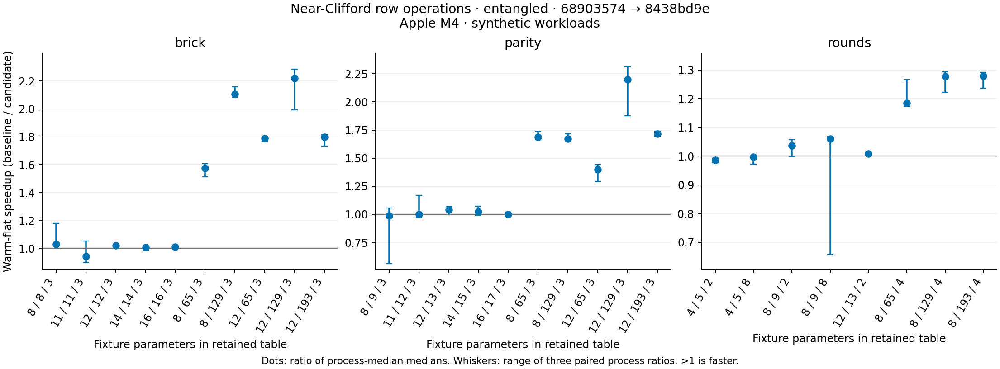
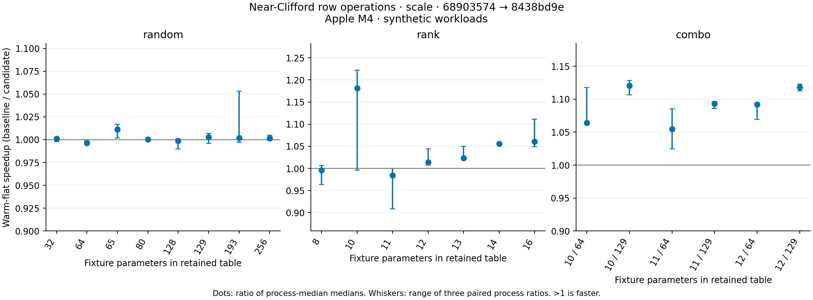

# Near-Clifford row operations after #770

The [43-case scale table](apple-m4-row-ops-scale-2026-10-03.md) and
[28-case entangled table](apple-m4-row-ops-entangled-2026-10-03.md) compare merged
#770 (`68903574abcb70f1c74e4581fc676704f2ed770d`) with row-product implementation
`8438bd9e5dcf4549ff0e1a8235277c0659848210`. Both use the same retained unified
Cargo lock, immutable timing drivers and fixtures, three alternating paired
processes, three repetitions and all six timing modes. Prototype measurements
are kept separately in ignored scratch and are not pooled into either campaign.
Reproduction and verification commands are in the [campaign README](../row_ops/README.md).

## Implementation and physics

The near-Clifford extension multiplies distinct tableau rows by contiguous XOR
and integer phase accumulation rather than scalar Pauli-product matches and
per-column reductions. For canonical P(x,z)=i^(xz)X^xZ^z, the product phase is
xh*zh + xi*zi + 2*zh*xi - (xh XOR xi)*(zh XOR zi), modulo four. Right S/CX/CZ
composition and forced random measurement use this helper. The byte-pinned legacy
row multiplication, physical Clifford gates and pure-Clifford execution path are
unchanged. No unsafe code, cache limit, floating-point reduction, allocation policy,
RNG draw or public API change is introduced.

An exhaustive local differential test checks all 16 Pauli products, all input
phases and both row orderings against the separate legacy match table. Complete
randomized row snapshots agree through width 4096. Existing differential tests
check canonicalization and forced measurement, and existing independent dense
oracles cover probability, projection, reset, feedback and entangled correlations.
The added full-width magic-GHZ integration checks independent analytic conditional
Born probabilities at widths 2/63/64/65/127/128/129/193, including mixed X/Y
measurement and reset. This witness contains genuine gates and entanglement across
its full physical width; it is not idle padding or a reduced dense witness.

Both campaigns preserve pristine structured/flat/prepared/individual outputs and
RNG continuation. Their separate diagnostic builds reproduce pristine semantics.
The scale entry retains all four semantic payload sets, and the verifier binds
scale circuit text to the historical same-driver fixtures. The entangled independent
dense-oracle coverage remains 14 exact-width and 14 explicitly reduced family
witnesses, with 2,682 conditional Born-probability comparisons per revision.
Reduced witnesses and joint-support checks do not prove full-width distribution
frequencies. The full-width GHZ test complements, but does not replace, that limit.

## Measured results

Warm-flat milliseconds, medians of three process medians; speedup is their ratio:

| Workload | Shots | #770 | Row operations | Speedup |
| --- | ---: | ---: | ---: | ---: |
| Brick rank 8 / width 129 | 64 | 41.052 | 19.499 | 2.11× |
| Parity rank 12 / width 129 | 16 | 26.956 | 12.265 | 2.20× |
| Parity rank 12 / width 193 | 16 | 44.644 | 25.997 | 1.72× |
| Four rounds / width 129 | 64 | 78.266 | 61.276 | 1.28× |
| Four rounds / width 193 | 64 | 211.349 | 165.256 | 1.28× |
| Brick rank 16 / width 16 | 8 | 1.428 | 1.410 | 1.01× |
| Independent rank 11 / prefix 129 | 64 | 15.758 | 14.418 | 1.09× |
| Independent rank 12 / prefix 129 | 16 | 4.312 | 3.856 | 1.12× |
| Syndrome rounds 32 | 1000 | 21.702 | 21.364 | 1.02× |
| Terminal 20q | 1000000 | 98.926 | 98.452 | 1.00× |

Wide entangled workloads gain materially; compact active-state kernels and the
already-symbolic million-shot path gain little. This is the intended target of
#770's profile-guided next step, not a claim that every workload gets faster.
Compact brick rank 11 and cached parity rank 8 have about 3–4% median paired
warm-flat slowdowns. Some small/cached pairs are noisy; their spreads remain visible
in the plot. Neither campaign triggers the disclosed six-mode screen (median
paired slowdown >=15% and every pair >=10%). This is a regression screen, not a
significance test or proof that no regression exists.

The original cache's 2048-coefficient, depth, node and conservative byte limits
remain unchanged. Rank 12 roots still take the uncached active-state path. RSS is
whole-process high-water memory including validation, multiple live samplers and
output allocations; do not interpret it as isolated cache memory.

## Post-change profiles

[Profile metadata](apple-m4-row-ops-profiles-2026-10-03/metadata.json) binds three
exact circuits to a separate debug/frame-pointer release build. The driver retains
64-shot batches, including for compact rank 16; its batch count is not timing
campaign evidence. Fractions are inclusive main-thread samples, counting repeated
ancestor/descendant occurrences of the same function once. Rows overlap and must
not be added; profile fractions are not pristine timing-build function speedups.

| Circuit | Function | Samples / main samples | Fraction |
| --- | --- | ---: | ---: |
| Brick rank 16 / width 16 | project_active_measurement | 4070 / 6432 | 63.3% |
| Brick rank 16 / width 16 | pauli_probability_zero | 1724 / 6432 | 26.8% |
| Parity rank 12 / width 129 | single_qubit_pauli | 4524 / 6504 | 69.6% |
| Parity rank 12 / width 129 | reconstruct_physical_pauli | 3779 / 6504 | 58.1% |
| Parity rank 12 / width 129 | Pauli::multiply_tableau_row | 3279 / 6504 | 50.4% |
| Parity rank 12 / width 129 | absorb_independent_measurement | 3356 / 6504 | 51.6% |
| Parity rank 12 / width 129 | row_mult_near_clifford | 550 / 6504 | 8.5% |
| Four rounds / width 129 | apply_clifford | 3523 / 6470 | 54.5% |
| Four rounds / width 129 | single_qubit_pauli | 1208 / 6470 | 18.7% |
| Four rounds / width 129 | absorb_independent_measurement | 1193 / 6470 | 18.4% |
| Four rounds / width 129 | row_mult_near_clifford | 118 / 6470 | 1.8% |

The remaining wide terminal cost is Pauli reconstruction and its separate
`Pauli::multiply_tableau_row` kernel, rather than the newly specialized tableau
row multiplication. Investigate that path with exact phase tests and frame-change
invalidation rules. Mid-circuit execution remains dominated by physical Clifford
updates; compact high-rank projection is still a separate major target.

## Scope and next work

The measured improvements support continuing with targeted implementation rather
than expanding the generic synthetic matrix. After the wide row kernel, wide Pauli reconstruction and compact
high-rank projection allocation/traversal are the next measured targets.
Application-scale syndrome/feedback workloads and x86 paired measurements remain
useful next evidence. The OMEN preflight found an online 24-CPU/35-GiB Ubuntu node,
but no Cargo/Rust toolchain, so no x86 timing or package installation occurred.
All performance conclusions here are Apple M4-only and workload-specific.
