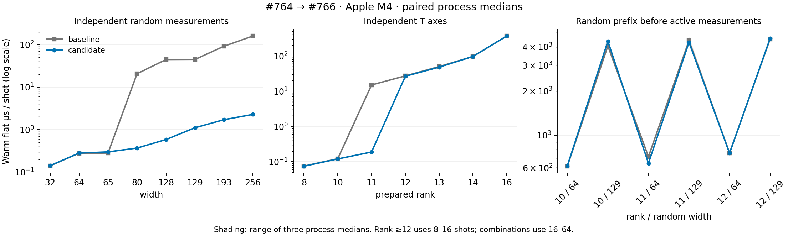

# Near-Clifford expanded benchmark and profiling

The expanded M4 campaign supports returning to targeted optimization. The #766
improvements hold over the wider matrix; the largest remaining costs are wide
physical-Pauli conversion while active axes remain, and high-rank measurement
projection after the coefficient-cache limit. Another broad sweep is unlikely to
be more useful than fixing these measured paths.

The [43-configuration table](apple-m4-scale-2026-09-30.md),
[raw paired timings and diagnostics](apple-m4-scale-2026-09-30.json), and
[reproduction harness](../scale/README.md) compare pristine merged #764 (`7cc2fa86`)
with #766 (`f4b59661`). The host is Apple M4, macOS 27.0.1, Rust 1.93.1; dependencies
use the same retained lock (including rand 0.8.7). There are three paired process
invocations and three repetitions per mode. This is within-host evidence, not a
cross-platform performance claim.

## Validation and coverage

All 35 distinct circuits passed seeded structured/flat, prepared/individual and
RNG-continuation equality checks. Outputs and RNG continuation also matched across
revisions. Both diagnostic builds repeated these checks against pristine binaries,
for 70 additional circuit checks. These are implementation-equivalence checks,
not an independent simulator or statistical physics oracle.

The matrix covers 23 scale configurations, 12 mixed configurations, and eight extra
usage configurations. Widths span 32–256 independent random bits, 256/1024 repeated
records, rank 8–16, and rank 10/11/12 combined with 64/129 independent random
measurements placed before active measurements. Mixed circuits include
interleaved T/measure/reset, stochastic feedback, and 1/3/8/32 synthetic syndrome
rounds. API use spans zero through one million shots, structured/flat output,
fresh preparation, first calls and retained samplers.

A timing bug inherited from the smaller harness was corrected: preparation and
cold/API calls now use freshly compiled executors, so measurement-order planning
is not prewarmed by validation. Compilation remains outside these timers. The
superseded partial run is kept in ignored scratch, not combined with this report.

## Measured changes

All times below are warm flat process-median milliseconds. Speedup is the median
baseline time divided by the median candidate time.

| Workload | Shots | #766 ms | Speedup |
| --- | ---: | ---: | ---: |
| Random 64 | 1000 | 0.2808 | 0.99× |
| Random 80 | 1000 | 0.3678 | 56.23× |
| Random 128 | 1000 | 0.5839 | 76.46× |
| Random 129 | 1000 | 1.1070 | 40.57× |
| Random 256 | 1000 | 2.2787 | 70.24× |
| Rank 11 | 1000 | 0.1887 | 79.57× |
| Rank 12 | 16 | 0.4249 | 1.02× |
| Rank 11 + random prefix 129 | 64 | 274.8418 | 1.03× |
| Syndrome rounds 32 | 1000 | 21.6866 | 1.00× |
| Terminal 20q | 1000000 | 139.9169 | 1.01× |

The 128→129 representation transition remains about 1.9× here and then grows
smoothly. Rank 11→12 is the remaining coefficient-limit cliff: normalized warm
flat time rises from 0.189 µs/shot to 26.55 µs/shot (different batch sizes, so this
normalization describes these particular measurements). In the 256-shot diagnostic
probe, rank 12 records 256 coefficient-limit fallbacks and a prepared coefficient
count of 4096.

Mixed circuits show roughly unchanged performance; their diagnostic probes use
256 unplanned shots each. The public 63-shot terminal call improves from 1.882 ms
to 0.555 ms, about 3.39×, because #766 selects the prepared path for small batches.

No configuration with positive shots met the regression screen of at least 15%
median paired slowdown and at least 10% slowdown in all three pairs. This is a
screening rule, not a significance test or proof of no regressions. The million-shot
public API was noisy and warranted the separate confirmation described below.

RSS is a whole-process high-water mark including validation, multiple live
samplers and outputs. Wide random-only candidate cases stay around 2.8–4.1 MiB.
Rank-11/prefix-129 reaches 119.5 MiB in this harness; its cache exhausts the 432-node
budget. This must not be interpreted as a single cache exceeding its 64 MiB model.
Million-shot output brings the process peak to 123.4 MiB.



## Profile evidence and next implementation

The [retained profile metadata](apple-m4-scale-profiles-2026-09-30/metadata.json)
records the separate release build with line debug information and frame pointers,
source/binary/driver/lock hashes, exact circuits and eight-second `sample` captures.
Profiling ran after campaign timing finished. Driver batch counts are not benchmark
results.

1. **First: specialize the single-qubit physical-Pauli conversion for wide states.**
   In [rank 11 / prefix 129](apple-m4-scale-profiles-2026-09-30/combo_11_129.sample.txt),
   `physical_pauli` accounts for 6275/6770 main-thread samples at the top of the stack,
   about 92.7%. The diagnostic probe reports 255 node-limit fallbacks and one
   depth-limit fallback in 256 shots, with no symbolic suffix calls. Inspect the
   dense dot products in `single_qubit_pauli` → `physical_pauli`: a single physical
   target can obtain coordinates by column access instead of repeatedly scanning
   mostly-zero physical vectors. Preserve the Pauli phase and frame reconstruction
   invariants. Frame changes during canonicalization mean a previously computed
   Pauli cannot simply be reused without transformation or invalidation.
2. **Then: reduce high-rank projection/probability scans and temporary vectors.**
   In [rank 12](apple-m4-scale-profiles-2026-09-30/rank_12.sample.txt), projection
   accounts for 2607/6639 top-of-stack samples (39.3%), probability calculation for
   1814 (27.3%), and a vector collection path for 813 (12.2%, mostly under collapse).
   Optimize the measured kernels and allocation first; assess a bounded cache policy
   afterward. Raising the coefficient cap alone would move the threshold and increase
   cached-state memory rather than address the scaling cost.
3. **After those: mid-circuit syndrome execution and allocation.**
   [32-round syndrome profiling](apple-m4-scale-profiles-2026-09-30/qec_32.sample.txt)
   spreads cost over tableau CX/measurement, physical Pauli conversion and allocation.
   Wide-Pauli work may help this path too. Avoid broad legacy-tableau edits without
   preserving the repository's pinned compatibility behavior.

Acceptance for the next optimization should use the same paired harness, seeded
output/RNG checks, rank/width combination cases, cold preparation and RSS. A new
large matrix expansion can wait until these two hotspots have been addressed.

## Million-shot confirmation

The [six-pair follow-up](apple-m4-scale-million-confirmation-2026-09-30.json) used
the exact original binaries, alternating order, three repetitions per process.
The initially slower public-API result did not reproduce: its median paired speedup
is 1.005×, with a 0.992–1.016× range over the six pairs. Warm flat is 1.017× and
warm structured 1.004×. Absolute times changed substantially between sessions
(public API medians about 119 ms per version), reinforcing the need for paired
ratios. Both sessions are retained; no result was replaced or pooled selectively.

```sh
python3 benchmarks/near_clifford/scale/repeat.py \
  benchmarks/near_clifford/results/apple-m4-scale-2026-09-30.json \
  terminal_20q 1000000 --pairs 6 --repetitions 3 \
  --output drafts/near-clifford-scale/million-confirmation.json
```

Artifact completeness and provenance were checked with:

```sh
python3 benchmarks/near_clifford/scale/verify.py \
  benchmarks/near_clifford/results/apple-m4-scale-2026-09-30.json \
  --binaries drafts/near-clifford-scale
rustfmt --edition 2024 --check benchmarks/near_clifford/scale/main.rs \
  benchmarks/near_clifford/scale/profile.rs
python3 -m py_compile benchmarks/near_clifford/scale/*.py
```

All passed. Invalid `--pairs 0` was rejected before building. Production simulator
code and workspace manifests are unchanged; no new production tests or CI result
are claimed for this benchmark-only work.

## Platform limitation

The OMEN preflight succeeded for the current Ubuntu account `zhongyi`: 24 logical
CPUs, 35 GiB visible RAM and about 945 GiB free disk. The former `/home/nzy` environment
is absent and neither WSL nor Windows exposes Cargo/Rust. No benchmark was launched
and no compiler/system environment was installed. x86 timing remains unverified;
run the same retained harness after the node's Rust environment is available.
