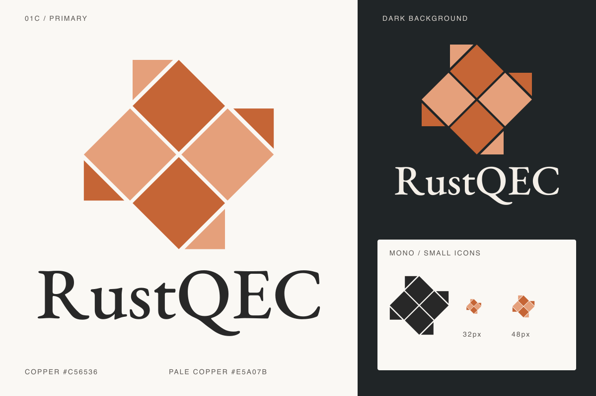

# RustQEC visual identity

The primary logo follows approved concept **01C**: a diamond-oriented
surface-code patch, four square bulk-check faces, and four triangular
two-body boundary-check faces. Opposite bulk faces share a color; each
boundary half face differs from its adjacent bulk face. Keep this arrangement
and the diagonal orientation when using the mark. It is a stylized code patch,
not a circuit diagram or an assertion about a particular decoder.



## Assets

| File | Use |
| --- | --- |
| [rustqec-logo.svg](../site/static/brand/rustqec-logo.svg) | Primary stacked logo on light backgrounds |
| [rustqec-logo-dark.svg](../site/static/brand/rustqec-logo-dark.svg) | Primary stacked logo on dark backgrounds |
| [rustqec-lockup.svg](../site/static/brand/rustqec-lockup.svg) | Horizontal logo for the light site navigation |
| [rustqec-mark.svg](../site/static/brand/rustqec-mark.svg) | Standalone icon and SVG favicon |
| [favicon-32.png](../site/static/brand/favicon-32.png) | 32px PNG favicon fallback |
| [favicon.ico](../site/static/favicon.ico) | ICO fallback containing 16px, 32px, and 48px images |
| [rustqec-mark-mono.svg](../site/static/brand/rustqec-mark-mono.svg) | Single-color icon for print or engraving |
| [preview.png](../site/static/brand/preview.png) | Raster review sheet; not a replacement for the SVG originals |

The SVGs have transparent backgrounds, accessible titles and descriptions,
and no external image or font dependencies. The wordmark is outlined, so it
does not change with the viewer's installed fonts. No AI-generated draft
bitmap is embedded in the production assets.

## Color and spacing

| Role | Color |
| --- | --- |
| Copper | `#C56536` |
| Pale copper | `#E5A07B` |
| Light-background wordmark / monochrome icon | `#282828` |
| Dark-background wordmark | `#F4EFE8` |

Use flat fills. Keep all eight faces and the open channels between them;
do not recenter the boundary triangles over the patch's corner tips.
Leave at least one half-face's short side of clear space around standalone
placements. Use the icon alone at small sizes; keep the wordmark readable
and preserve each asset's aspect ratio. The site extends the logo's copper palette
with darker tones for readable links and controls:

| Website role | Color |
| --- | --- |
| Primary action / focus ring | `#A84D24` |
| Link / active text | `#863C20` |
| Active background | `#F7E8DD` |
| Page / subtle surface | `#FCFAF7` / `#F5EFE8` |
| Body / secondary text | `#282828` / `#6B615B` |

Use the original copper and pale copper for the mark; use the darker action
color behind white button text. Scientific plot colors and success/error
states retain their distinct meanings. The header uses the horizontal lockup
at 176px wide and the footer a 128px lockup. Keep the home introduction
focused on its headline without repeating the mark. The README uses the stacked logo at 200px wide with a matching
dark-background variant, so it does not dominate the repository introduction.

## Sources and regeneration

The geometry is defined in `tools/generate_brand_assets.py`. The wordmark
uses **EB Garamond Medium (weight 500)**, converted to SVG paths with
FontTools. The font's [SIL Open Font License](../site/static/brand/OFL.txt)
is included with the assets. Font tooling is needed only to regenerate
the assets, not to build the site or display the logo.

Source font: [Google Fonts EB Garamond](https://github.com/google/fonts/tree/main/ofl/ebgaramond).
The generator checks the downloaded font's SHA-256:

```text
ef9512f92f6d579e5dc75af59a5a4b1b8b47d2eda89e00b954d44520e5369027
```

With `fonttools` installed in your Python environment:

```sh
mkdir -p drafts/brand
curl --globoff -fL 'https://raw.githubusercontent.com/google/fonts/main/ofl/ebgaramond/EBGaramond[wght].ttf' -o drafts/brand/EBGaramond.ttf
python3 tools/generate_brand_assets.py --font drafts/brand/EBGaramond.ttf
```

If the upstream font changes, retrieve the matching historical revision
instead of silently changing the typeface. Keep the font license with
redistributed wordmark assets. Regenerate the raster preview after changes
to the vector originals.

## Browser tab icons

The shared page template declares ICO and PNG fallbacks before the SVG icon.
Browsers choose an appropriate supported format and size. All paths are relative
to the page's configured root, including nested documentation pages on GitHub
Pages. The `?v=01c-1` query identifies this favicon revision; update it on all
three links when changing the icon to refresh cached resources.

Regenerate raster fallbacks from the committed SVG after changing the mark:

```sh
python3 -m venv drafts/favicon-venv
drafts/favicon-venv/bin/python -m pip install CairoSVG Pillow
drafts/favicon-venv/bin/python tools/generate_favicons.py
```

CairoSVG requires the Cairo system library (on macOS, `brew install cairo` if
needed). These are regeneration dependencies, not site-build dependencies.
The ICO uses bitmap entries for compatibility with older readers. The PNG
and ICO have transparent backgrounds and preserve the mark's aspect ratio.
