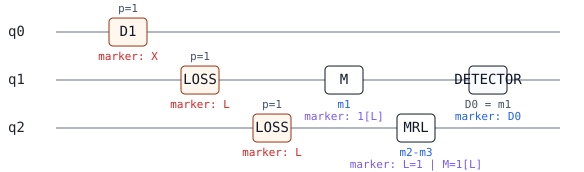
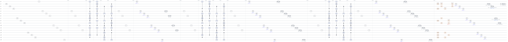
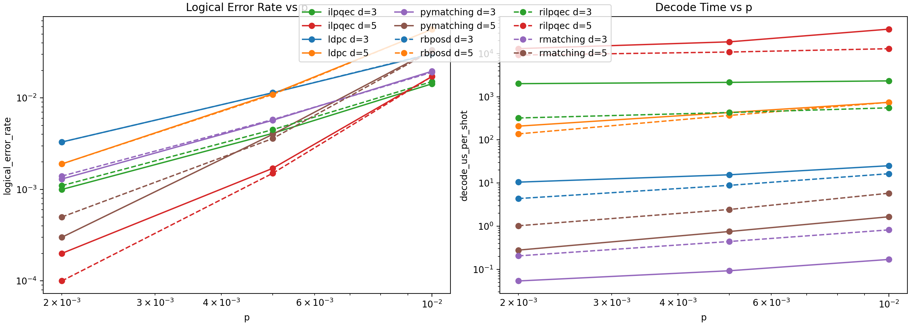
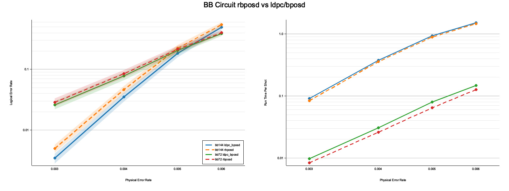

# Showcase Index

This directory is the stable front door for runnable rstim workspace
showcases. Each showcase page should explain what the example demonstrates,
how to run it, where the result appears, which code owns it, how to verify it,
and what its limits are.

Individual showcase pages will be added by follow-up issues. Use
[`_template.md`](docs/showcases/_template.md) for new pages.

## Benchmarked Documentation Site

The [benchmarked documentation site](https://nzy1997.github.io/rstim/)
turns these runnable showcase pages into a broader Pages reference with
workspace walkthroughs, benchmark evidence, checked results, methodology and
claims limits, and the QP101 schema browser.

Build and check the same Pages tree locally:

```sh
make build-site
python3 tools/check_site_build.py _site
```

## Visual Highlights

| Compact atom-loss sample-shot circuit | Surface-code d=3 r=3 atom-loss sample |
| --- | --- |
|  |  |

| Surface-code decoder comparison | BB72/BB144 circuit BP-OSD comparison |
| --- | --- |
|  |  |

## Categories

### Simulator And CLI Workflows

Showcases in this category should demonstrate `rstim` circuit simulation,
sampling, detector event extraction, detector error model analysis, and CLI
input/output behavior.

Primary code and docs:

- [`rstim/`](rstim/)
- [`rstim/doc/getting_started.md`](rstim/doc/getting_started.md)
- [`rstim/doc/cli.md`](rstim/doc/cli.md)
- [`README.md`](README.md)

Showcases:

- [`rstim CLI DEM Pipeline`](docs/showcases/rstim-cli-dem-pipeline.md)

### Visualization And QP101 Artifacts

Showcases in this category should demonstrate built-in SVG rendering, seeded
sample-shot overlays, detector-error-model highlights, QP101 JSON export, and
the optional Typst renderer fixtures.

Primary code and docs:

- [`rstim/`](rstim/)
- [`qp101-viz/`](qp101-viz/)
- [`qp101-viz/README.md`](qp101-viz/README.md)
- [`qp101-viz/examples/`](qp101-viz/examples/)

Showcases:

- [`rstim Render SVG Atom-Loss`](docs/showcases/rstim-render-svg-atom-loss.md)

### Decoder And Benchmark Workflows

Showcases in this category should demonstrate decoder integrations, benchmark
harnesses, smoke runs, and reproducible comparison outputs.

Showcases:

- [`Benchmark And Reproduction Evidence`](docs/showcases/benchmark-evidence.md)
- [`qec-code random-window benchmark`](docs/showcases/qec-code-random-window-benchmark.md)
- [`rstim-vs-Stim Simulator Evidence`](docs/showcases/rstim-vs-stim-simulator.md)

Primary code and docs:

- [`rsinter/`](rsinter/)
- [`rmatching/`](rmatching/)
- [`rbposd/`](rbposd/)
- [`rilpqec/`](rilpqec/)
- [`benchmarks/surface_decoder_compare/`](benchmarks/surface_decoder_compare/)
- [`benchmarks/bb_circuit_bposd_compare/`](benchmarks/bb_circuit_bposd_compare/)
- [`benchmarks/surface_decoder_compare/README.md`](benchmarks/surface_decoder_compare/README.md)

### Code Construction Workflows

Showcases in this category should demonstrate CSS code construction, built-in
code families, sparse support exports, distance checks, and code-oriented CLI
flows.

Available showcases:

- [`qec-code CSS construction`](docs/showcases/qec-code-css-construction.md)

Primary code and docs:

- [`qec-code/`](qec-code/)
- [`qec-ilp-core/`](qec-ilp-core/)
- [`docs/apm_decoder_hierarchy.md`](docs/apm_decoder_hierarchy.md)
- [`docs/bb144_circuit_bposd_reproduction.md`](docs/bb144_circuit_bposd_reproduction.md)

## Documentation Follow-Up Policy

Write only high-confidence behavior that exists in the repository today. If a
claim needs algorithm review, benchmark interpretation, or scientific review,
do not present it as a showcase claim.

Open a follow-up issue for the review question when it matters. Link that
issue from `Limits` when the uncertainty is a known gap readers should see, or
omit the uncertain claim entirely.

## Page Contract

Every individual showcase page must include these sections:

- `What This Shows`
- `Run It`
- `Expected Result`
- `Code`
- `Verification`
- `Limits`

Run the checker before opening a showcase documentation pull request:

```sh
python3 tools/check_showcase_docs.py docs/showcases
```
