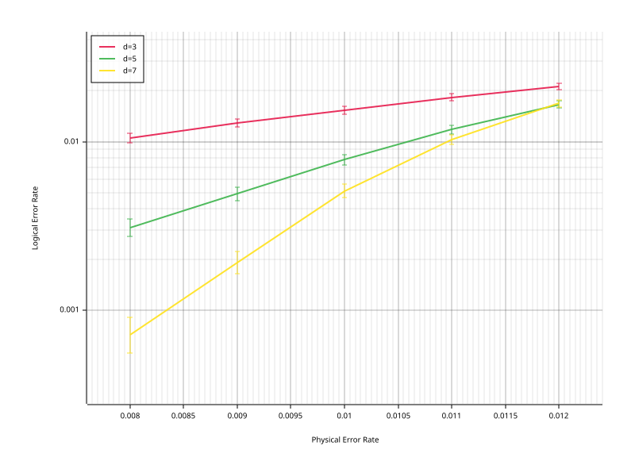

# Getting Started with rstim

## What is rstim?

rstim is a Rust port of [Stim](https://github.com/quantumlib/Stim), a high-performance
tool for quantum error correction circuit simulation. It provides:

- A stabilizer circuit simulator using the tableau/frame formalism
- Noise channels (depolarizing, bit-flip, etc.)
- Detectors and observables for tracking errors
- Code generators for repetition codes, surface codes, and color codes
- A detector error model (DEM) extractor for use with decoders
- Batch sampling for Monte Carlo experiments

If you are familiar with Stim's Python API, rstim exposes the same concepts
through Rust modules: `parser`, `sampler`, `codegen`, `error_analyzer`, and more.

## Inspect a circuit from the CLI

Before sampling or analyzing a circuit, it is often useful to inspect its size
and structure from the command line:

```sh
printf 'H 0\nREPEAT 2 {\n  M 0\n  DETECTOR rec[-1]\n  TICK\n}\n' | rstim stats
```

Output:

```text
instruction_count: 5
repeat_blocks: 1
max_repeat_depth: 1
num_qubits: 1
num_measurements: 2
num_detectors: 2
num_observables: 0
num_ticks: 2
num_sweep_bits: 0
```

This summary mixes:

- structural counts such as `instruction_count`, `repeat_blocks`, and `max_repeat_depth`
- expanded execution-facing counts such as `num_measurements`, `num_detectors`, and `num_ticks`

That distinction matters for repeated circuits. A compact source circuit can
still imply a much larger expanded workload.

For scripting or shell pipelines, request JSON output instead:

```sh
printf 'M 0\nDETECTOR rec[-1]\n' | rstim stats --json
```

Once you understand the circuit shape, a typical CLI workflow is:

1. `rstim stats` to inspect size and repeat structure
2. `rstim sample` or `rstim detect` to generate shot data
3. `rstim analyze_errors` to derive a detector error model when needed

The full command reference is in [`cli.md`](cli.md).

## Create a circuit and sample

Parse a simple Bell pair circuit and sample measurement outcomes:

```rust
use rstim::parser::parse_lines;
use rstim::sampler::sample_batch;
use rand::SeedableRng;
use rand::rngs::StdRng;

fn main() {
    // Parse a Bell pair circuit
    let circuit = parse_lines("H 0\nCNOT 0 1\nM 0 1").unwrap();

    // Sample 10 shots
    let mut rng = StdRng::seed_from_u64(42);
    let output = sample_batch(&circuit, 10, &mut rng).unwrap();

    // Print results (BitTable is indexed as .get(measurement, shot))
    for shot in 0..10 {
        let m0 = output.measurements.get(0, shot) as u8;
        let m1 = output.measurements.get(1, shot) as u8;
        println!("shot {}: {} {}", shot, m0, m1);
    }
}
```

Output:

```
2 measurements, 10 shots
  shot 0: 0 0
  shot 1: 0 0
  shot 2: 0 0
  shot 3: 0 0
  shot 4: 0 0
  shot 5: 0 0
  shot 6: 0 0
  shot 7: 0 0
  shot 8: 0 0
  shot 9: 0 0
```

The two measurement outcomes in each shot will always agree (`00` or `11`),
because H + CNOT creates the Bell state (|00> + |11>) / sqrt(2).

## Detectors

Detectors are parity checks on measurement results. They fire (produce a `1`)
when the parity deviates from its expected noiseless value. Adding noise makes
detectors fire probabilistically:

```rust
let circuit = parse_lines("
    H 0
    CNOT 0 1
    X_ERROR(0.1) 0
    M 0 1
    DETECTOR rec[-1] rec[-2]
").unwrap();

let mut rng = StdRng::seed_from_u64(42);
let output = sample_batch(&circuit, 1000, &mut rng).unwrap();

// output.detections is indexed as .get(detector, shot)
let fires: usize = (0..1000)
    .filter(|&s| output.detections.get(0, s))
    .count();
println!("Detector fired {}/1000 times (~10% expected)", fires);
```

Output:

```
Detector fired 99/1000 times (~10% expected)
```

## Generate QEC circuits

rstim includes code generators for standard QEC experiments. These produce
full circuits with noise, detectors, and observable annotations.

```rust
use rstim::codegen::{repetition_code_memory, repetition_code_memory_with_params, NoiseParams};

// Simple: single noise parameter applied uniformly
let circuit = repetition_code_memory(5, 3, 0.01);

// Advanced: per-channel noise control
let params = NoiseParams {
    before_round_data_depolarization: 0.01,
    after_clifford_depolarization: 0.005,
    before_measure_flip_probability: 0.01,
    after_reset_flip_probability: 0.005,
};
let circuit = repetition_code_memory_with_params(5, 3, params);

// Surface code (rotated layout, Z-basis memory experiment)
use rstim::codegen::rotated_memory_z_with_params;
let circuit = rotated_memory_z_with_params(3, 9, params);
```

The `distance` parameter controls code size and the `rounds` parameter controls
how many syndrome extraction rounds are performed.

## Detector Error Model

The error analyzer converts a noisy circuit into a detector error model (DEM).
A DEM describes which error mechanisms can cause which detectors to fire and
which observables to flip, along with their probabilities.

```rust
use rstim::error_analyzer::ErrorAnalyzer;

let dem = ErrorAnalyzer::circuit_to_dem(&circuit).unwrap();
println!("{}", dem);
```

Example output (for a simple 3-qubit circuit with `X_ERROR(0.01)`):

```
error(0.01) D1 L0
error(0.01) D0 D1
error(0.01) D0
```

For minimum-weight perfect matching (MWPM) decoders, use the decomposed
version, which breaks multi-fault error mechanisms into independent
single-fault components:

```rust
let dem = ErrorAnalyzer::circuit_to_dem_decomposed(&circuit).unwrap();
```

## Decode with rmatching

To close the loop and actually correct errors, pair rstim with the `rmatching`
crate (a Rust MWPM decoder). The workflow is:

1. Generate a circuit and extract its DEM.
2. Build a `rmatching::Matching` from the DEM.
3. Sample detection events from the circuit.
4. Decode each shot's syndrome to predict observable flips.
5. Compare predictions against actual observable flips to measure the logical
   error rate.

```rust
// Pseudocode (requires rmatching crate as a dependency)
let circuit = repetition_code_memory(5, 10, 0.01);
let dem = ErrorAnalyzer::circuit_to_dem_decomposed(&circuit).unwrap();

// Build decoder from DEM text
let matching = rmatching::Matching::from_dem(&dem.to_string()).unwrap();

// Sample
let output = sample_batch(&circuit, 1000, &mut rng).unwrap();

// Decode each shot
let mut errors = 0;
for shot in 0..1000 {
    let syndrome: Vec<bool> = (0..output.detections.num_major())
        .map(|d| output.detections.get(d, shot))
        .collect();
    let predicted = matching.decode(&syndrome);
    let actual = output.observable_flips.get(0, shot);
    if predicted[0] != actual {
        errors += 1;
    }
}
println!("Logical error rate: {}/{}", errors, 1000);
```

Without a decoder, you can still inspect the raw sampling output:

```
Shots with detection events: 837/1000
Actual observable flips: 103/1000
```

## Decode with rbposd through rsinter

When `rbposd` is available in the same workspace, `rsinter` can compile a DEM
into an in-tree BP+OSD decoder:

```rust
use std::collections::HashMap;

use rbposd::DecoderConfig;
use rsinter::decode::RbposdDemDecoder;

let mut decoders: HashMap<String, Box<dyn rsinter::decode::Decoder>> = HashMap::new();
decoders.insert(
    "rbposd".into(),
    Box::new(RbposdDemDecoder::new(DecoderConfig::default())),
);
```

## Estimate threshold

A threshold experiment sweeps over code distances and noise rates. Below
threshold, larger codes perform better; above threshold, they perform worse.

```rust
for d in [3, 5, 7] {
    for noise in [0.01, 0.05, 0.1] {
        let circuit = repetition_code_memory(d, d * 3, noise);
        let output = sample_batch(&circuit, 10000, &mut rng).unwrap();
        let errors: usize = (0..10000)
            .filter(|&s| output.observable_flips.get(0, s))
            .count();
        let error_rate = errors as f64 / 10000.0;
        println!("d={} p={:.2} error_rate={:.4}", d, noise, error_rate);
    }
}
```

Output (without decoding — raw observable flip rate):

```
d=3 p=0.01 error_rate=0.1074
d=3 p=0.05 error_rate=0.3518
d=3 p=0.10 error_rate=0.4589
d=5 p=0.01 error_rate=0.1567
d=5 p=0.05 error_rate=0.4259
d=5 p=0.10 error_rate=0.4983
d=7 p=0.01 error_rate=0.1990
d=7 p=0.05 error_rate=0.4642
d=7 p=0.10 error_rate=0.4974
```

Note: these are raw flip rates without decoding. With a MWPM decoder,
the error rates would be much lower — the decoder corrects most errors,
and increasing distance would improve performance below threshold.

When you plot `error_rate` vs `noise` for each distance, the curves cross at
the threshold noise rate.

## Use rsinter for parallel sampling

For large-scale experiments, the `rsinter` crate parallelizes sampling and
decoding across multiple threads. It also supports adaptive stopping (collect
until you have enough errors for statistical confidence) and CSV
save/resume.

```rust
use rsinter::task::{Task, CollectionOptions};
use rsinter::collect::{collect, CollectOptions};
use rsinter::decode::VacuousDecoder;
use rsinter::stats::shot_error_rate_to_piece_error_rate;
use std::collections::HashMap;

let tasks: Vec<Task> = [3, 5, 7].iter().map(|&d| {
    let circuit = repetition_code_memory(d, d * 3, 0.01);
    let dem = ErrorAnalyzer::circuit_to_dem(&circuit).unwrap();
    Task {
        circuit,
        decoder: "vacuous".into(),
        dem,
        metadata: serde_json::json!({"d": d, "p": 0.01}),
        collection_options: CollectionOptions {
            max_shots: Some(100_000),
            max_errors: None,
        },
    }
}).collect();

let mut decoders: HashMap<String, Box<dyn rsinter::decode::Decoder>> = HashMap::new();
decoders.insert("vacuous".into(), Box::new(VacuousDecoder));

let options = CollectOptions {
    num_workers: 4,
    max_shots: None,
    max_errors: None,
    max_batch_size: Some(1024),
    start_batch_size: 256,
    save_resume_filepath: None,
    print_progress: false,
};

let results = collect(tasks, decoders, &options).unwrap();
for stat in &results {
    let d = stat.metadata["d"].as_u64().unwrap();
    let rate = stat.errors as f64 / stat.shots as f64;
    let per_round = shot_error_rate_to_piece_error_rate(rate, (d * 3) as f64);
    println!("d={} shots={} errors={} shot_error_rate={:.4} per_round_rate={:.6}",
             d, stat.shots, stat.errors, rate, per_round);
}
```

Output (using VacuousDecoder — always predicts no flip):

```
d=3 shots=100000 errors=10554 shot_error_rate=0.1055 per_round_rate=0.013000
d=5 shots=100000 errors=15790 shot_error_rate=0.1579 per_round_rate=0.012491
d=7 shots=100000 errors=20410 shot_error_rate=0.2041 per_round_rate=0.012335
```

With a real decoder (e.g., rmatching), error rates would be much lower.
The `shot_error_rate_to_piece_error_rate` function converts per-experiment
error rates to per-round rates, making them comparable across different
round counts.

## Plot logical error rate vs physical error rate

After collecting stats with `rsinter`, visualize the threshold with
`rsinter::plot::plot_error_rate`. The x-axis is the physical error rate
(from task metadata), the y-axis is the logical error rate with confidence
intervals, and each curve is one code distance.

```rust
use rsinter::plot::plot_error_rate;
use std::path::Path;

// `results` is Vec<TaskStats> from rsinter::collect::collect(...)
// metadata contains {"d": 3, "p": 0.01, "r": 9} (d=distance, p=noise, r=rounds)

plot_error_rate(
    &results,
    |s| s.metadata["p"].as_f64().unwrap(),           // x: physical error rate
    |s| format!("d={}", s.metadata["d"].as_u64().unwrap()), // one curve per distance
    Path::new("threshold.svg"),                       // .svg (default) or .png
).unwrap();
```

The `errors / shots` ratio is used as the logical error rate. To express
it per round instead of per shot, convert with `shot_error_rate_to_piece_error_rate`
and store the result as the task's error count scaled accordingly, or plot
the raw per-shot rate and label the axis accordingly.

Example output for a rotated surface code under circuit-level noise near
threshold (d = 3, 5, 7; p ∈ {0.008 … 0.012}):


